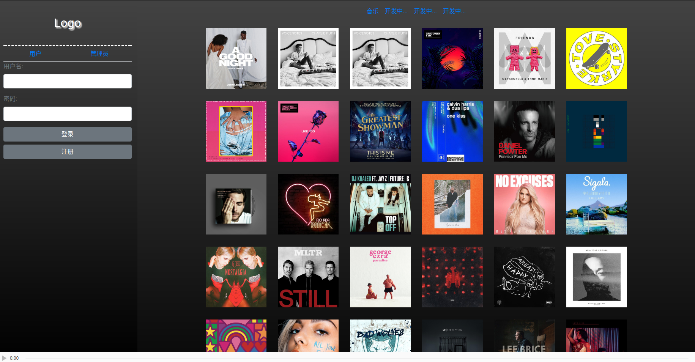
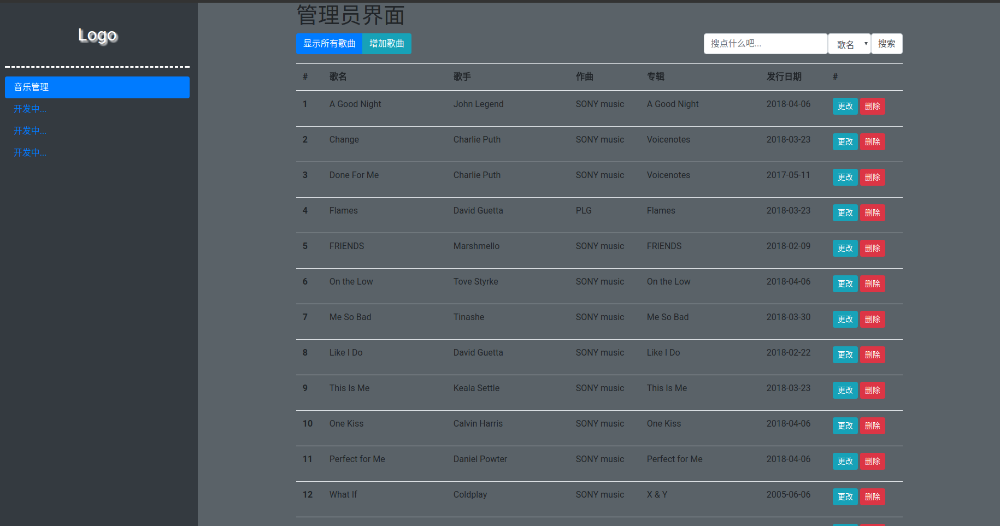

# java全栈工程师之路的实战项目 SSM+Bootstrap CMS(Always Test Version)
## 起因
在学习一些框架过程中,很难找到使用最新更新的框架构建的项目,来对照学习.如在学习spring5时各种版本兼容性BUG,故创此项目.

## 原则
* 若用到第三方jar包,使用最新版本编写
* 代码严格遵循第三方规范编写(如[阿里java编码规范](https://github.com/alibaba/p3c)、[W3Cschool前端编码规范](https://www.w3cschool.cn/bdl2e3/)...)
* 尽量增加注释的编写
* 该项目仅为学习过程的实践测试,非正式作品

## 开发平台
Ubuntu+IDEA+WebStorm

## 展示
展示网站: www.guohezuzi.top/JavaCMS

图片:

## Listen

